---

## 📱 Laundry App – Aplikasi Manajemen Laundry Berbasis Android

Aplikasi **Laundry App** adalah solusi manajemen laundry modern berbasis Android yang dikembangkan menggunakan **Kotlin** dan **Firebase**. Aplikasi ini dirancang untuk membantu pengelolaan transaksi, data pelanggan, layanan tambahan, serta manajemen pegawai dan cabang secara terintegrasi.

---

### ✨ Fitur Unggulan

* ✅ **Transaksi Laundry**
  Mencatat dan mengelola transaksi laundry harian dengan status dan detail lengkap.

* 👤 **Data Pelanggan**
  Menambahkan dan menyimpan informasi pelanggan yang saling terhubung dengan transaksi.

* 🧺 **Layanan & Layanan Tambahan**
  Pengelolaan berbagai jenis layanan laundry serta layanan tambahan (seperti parfum, setrika, dll).

* 🧑‍💼 **Manajemen Pegawai**
  Mencatat pegawai yang terlibat dalam proses operasional, termasuk siapa yang menangani transaksi tertentu.

* 🏢 **Manajemen Cabang**
  Mendukung pengelolaan multi-cabang untuk bisnis laundry dengan data yang saling terhubung.

* 🔗 **Relasi Antar Data yang Terstruktur**
  Semua data (pelanggan, layanan, pegawai, cabang) saling terhubung dengan baik melalui Firebase Realtime Database.
- 📤 Kirim hasil transaksi ke pelanggan via **WhatsApp**
- 🖨️ Cetak hasil transaksi **Dengan Printer Thermal**
  

---

### 🧪 Teknologi yang Digunakan

* 🧑‍💻 **Kotlin** – Bahasa pemrograman utama aplikasi Android modern.
* 🔥 **Firebase** – Digunakan untuk database real-time, dan manajemen data cloud.

---

### 📸 Screenshot

## 🖼️ Screenshot Aplikasi

| No. | Keterangan Tampilan        | Gambar                                     |
|-----|----------------------------|--------------------------------------------|
| 1   | Dashboard                  | 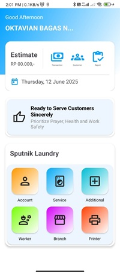             |
| 2   | Tambah                     |                 |
| 3   | Tampil Data                | 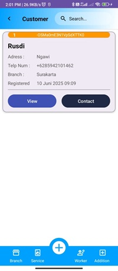           |
| 4   | Lihat Lebih Jelas          | 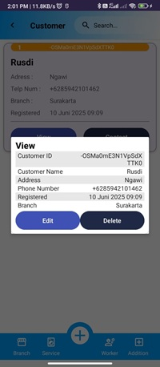     |
| 5   | Edit                       | 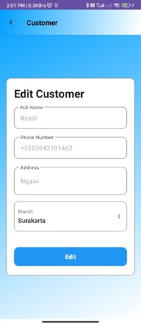                   |
| 6   | Pilih Cara Hubungi         | 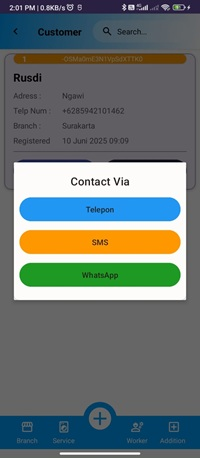           |
| 7   | Pemilihan Transaksi        | 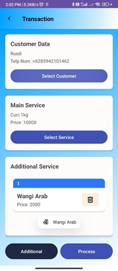    |
| 8   | Proses Transaksi           | 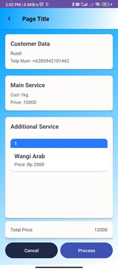       |
| 9   | Pilih Metode Pembayaran    | 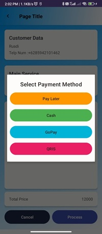      |
| 10  | Chat WhatsApp              | 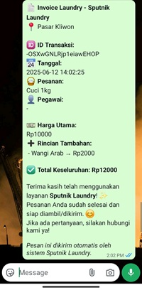                |
| 11  | Invoice                    | 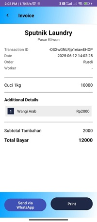                |
| 12  | Laporan                    | 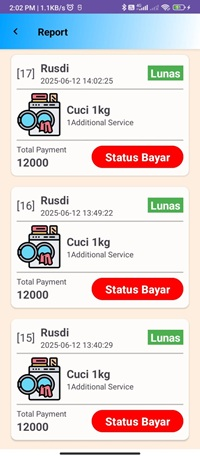                |

---

### 🚀 Status

* ⛔ Dalam Pengembangan

---